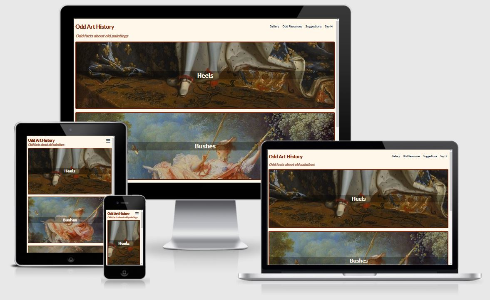
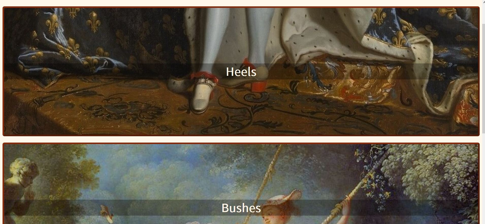
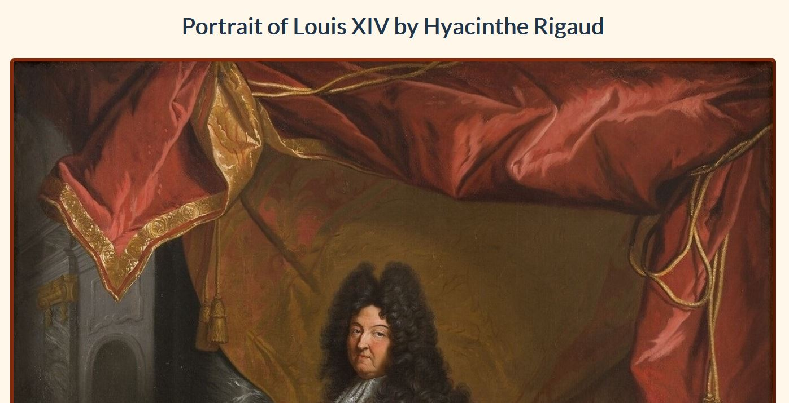
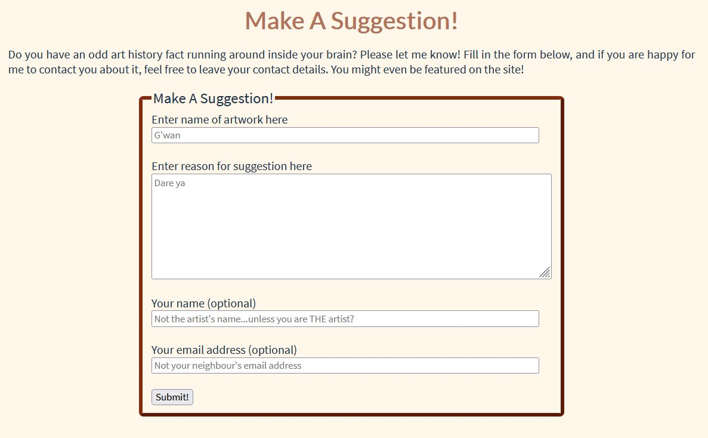
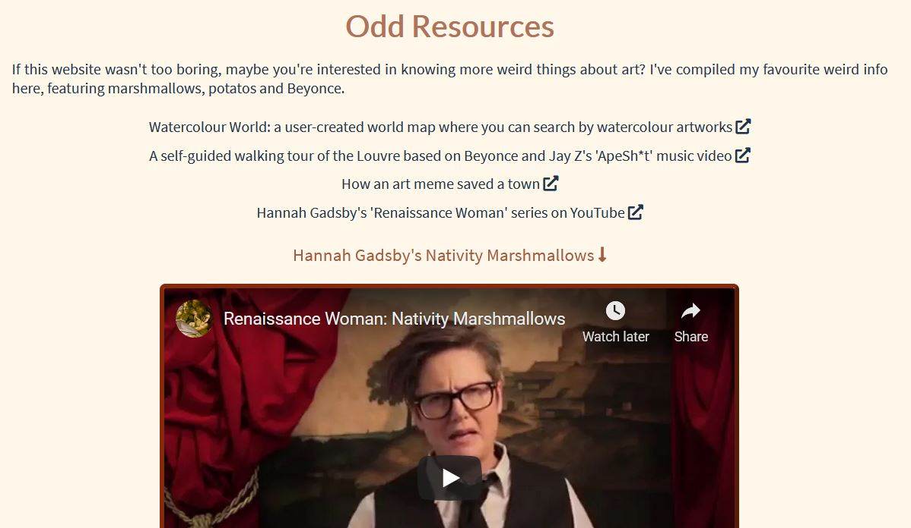
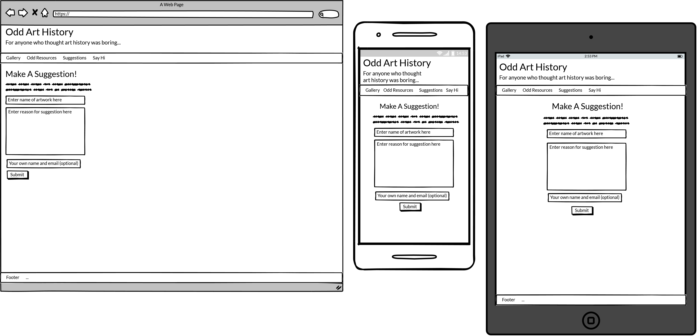

# Odd Art History

### Table of contents:

[Purpose](#purpose)

[Features](#features)

[User Stories](#user-stories) 

[Design and UX](#design-and-ux) 
* [Wireframes](#wireframes)
* [Colour schemes and typography](#colour-schemes-and-typography)
* [Accessibility](#accessibility)

[Technologies](#technologies)

[Testing ](#testing)

[Debugging and known bugs](#debugging-and-known-bugs)

[Deployment](#deployment)

[Credits](#credits)

[Acknowledgements](#acknowledgements)

## Purpose

The purpose of the site Odd Art History is to provide interesting and odd information about art history, specifically older paintings that some may consider boring. It acts as a small gallery, with a main hub and branching rooms, but instead of stuffy academic information, you'll learn something odd you didn't need to know but it'll be more fun.

The information is aimed to be presented to users who may consider the topic boring or uninteresting, or interested users who are looking for something new. The site aims to changes the minds of anyone who thought art history was boring and provide ways to further interact with the field through suggested resources, and multiple ways to get in contact.

It can be found here:

[Odd Art History](https://elyserh.github.io/odd-art-history/)

## Features

Features across all pages
* Clear header and site ‘slogan’ (odd facts about old paintings), making the purpose clear to users of the site.
* Navigation links listing Gallery, Odd Resources, Suggestions and Say Hi (which will link to Facebook), allowing for easy and intuitive navigation of site for all users. On desktop links will be underlined when they are hovered over to indicate to the user that they are clickable.
* On mobile and most tablets the navigation bar will change to a hamburger design and will remain on the same side of the screen for continuity and ease of use.
* Footer mirroring design of navigation links, which will link back to top of page, allowing for further easy navigation. Link will also be underlined when hovered over.
* Header will always remain at top of page (will not be sticky) and footer will always remain at bottom of page as user scrolls in order to allow for maximum view of visual content. Easy return to the home page will be provided to counteract this feature. The main purpose of the footer will be to link to the top of the page, so that the user does not have to scroll back up.
* The header 'Odd Art History' is also a link to the gallery page. It is not underlined when hovered over because it is not part of the navigation bar, but it is a link because this is common on web pages and therefore intuitive to modern web users.

Gallery (home/landing page)
* Three main images with text that links to painting pages - each one is a ‘hint’ of the painting, with a hint word and hint image. The aim of the images is to make the user curious about the content. The whole image acts as the link for intuitive use.
* The 'hint' link/text on each image is large and contrasting, to make it obvious to the user that it is important. It is also underlined when hovered over for the same reason.
* Images are page width on all devices; the large size of the paintings is mimicking a gallery and providing appealing visual content.
* Highest quality images available have been used; important for user to get as close experience as possible to viewing the painting in real life.

Painting pages (x3, ‘heels’, ‘bushes’, ‘balloons’)
* Spokes from gallery hub (design choice and value explained in UX section of readme).
* Full size painting with title, similarly to the home page, the images are presented fairly large in order to mimick a gallery experience.
* Informative and interesting text about painting with link back to gallery page for easy navigation, deliberately providing multiple ways to return to the landing page to counteract spoke aspect when needed.
* Links to image and text references clearly provided, with icons from Fontawesome as added visual cues.

Top part of page

Bottom part of page

Suggestions page
* Easy to use form for users to suggest odd paintings; make it simple for users to submit paintings with adequate space. Fun and different way to interact with the site.
* Optional to provide contact details (theoretically if site owner chooses a painting, they would contact the user and ask if okay to use their name, or possibly for more info).
* Submit button will open in a new tab so that users do not navigate away from site entirely.

Odd Resources page
* Page with links to further information; hopefully the site will have piqued the user's interest in odd art history and an easy-to-find page of further information will help them on their journey. All links will open in a new tab, with aria labels announcing the same.
* There will be an embedded video, as a teaser for one of the resources; it will not autoplay. The video thumbnail will also add visual interest to the page.

Future implementations
* On the painting pages I would like to introduce a second image with a detail from the painting; each will have a caption acting as a link and the user will be able to toggle between the two images. I worked towards this for a while using code from [Jess Mitchell](https://www.digitalocean.com/community/tutorials/css-css-only-click-handler) but ultimately realised I did not have time in this iteration. The 'heels' detail image has been left in the assets folder for future reference.

## User Stories

A first time visitor who is new to art history and comes to the site looking for information
* I want to easily understand the content and layout of the site 
* I want to intuitively navigate the site to browse content
* I want to be able to access and use the website as intended on any device
* I want to view interesting information on paintings 
* I want to find further information and non-academic resources

A first time visitor who is already interested in the field and comes to the site looking for something different to the usual academic information (such as Jstor.org):
* I want to easily understand the content and layout of the site
* I want to intuitively navigate the site to browse content
* I want to be able to access and use the website as intended on any device
* I want to view interesting information on paintings
* I want to find further information and non-academic resources
* I want to view sources for information if needed

A returning visitor wishing to contribute to the site:
* I want to to suggest a painting or artwork to be featured
* I want to be able to contact the site owner

A disabled user who is new or returning to the site:
* I want to be able to access and use the site in the same way as any of the aforementioned users

As the owner of the site:
* I want users to be able to use the site easily and intuitively
* I want users to be introduced to something new and fun
* I want users to be able to contact me to suggest paintings or just to get in touch
* I want to provide the same experience for all users

## Design and UX

For part of the site I used a hub and spoke design, with the Gallery (landing/home) page as the hub and the 3 painting pages as spokes. These pages do not appear on the navigation bar but can only be accessed from the links on the Gallery page.
The reason for this design for the painting pages is to bring a sense of playfulness to the website. It would be simple to add in nav links for each painting, either with the painting title or their ‘hint’ word (heels, bushes, balloons), but I feel this would take away from the intrigue and mystery of discovering information about the paintings. The experience will be almost like seeing a glimpse of a painting through a gallery doorway and turning around to go and see the painting. On the Gallery page I have added aria labels which I hope bring this same sense of playfulness and intrigue for a user using a screenreader.

I have included the Gallery, Odd Resources and Suggestions page on the nav bar so that the rest of the site is still clear and simple to navigate, as I don’t want the user to be frustrated or overloaded. I would like to introduce a small amount of playfulness, interactivity and intrigue but not so much that it becomes tiring or frustrating.

## Wireframes

Wireframes were produced using Balsamiq. Ultimately the final site followed the broad strokes of the designs but the key point that differed is that the title, subtitle and navigation links all ended up being on one axis, instead of having a separate navigation bar. I originally built the site as per the design in these wireframes, but the content in these elements does not take up much space and a lot of empty space was created. Visual design is not my forte, so I reached out to my sister Amelia Horan for assistance with the visual design. After talking through the design with her, I ended up with the design shown in the readme screenshots section.

Gallery page

Painting page

Odd Resources page

Suggestions page

## Colour schemes and typography

I used Google Fonts for the typography, and initially used colormind.io to choose a colour scheme. After speaking to my sister Amelia about the design we narrowed the colors down to the 3 shown below. I wanted to include a red accent, to mirror Louis XIV’s heels in Rigaud’s portrait, and used eyedropper.org to pick the colour from the original picture (#852a0d). A cream background (#fff7e9) was chosen for the whole site, to provide a contrast but not be too stark.
The main text is a dark navy, which is from the original colormind scheme (#20344a).

  

The hamburger used for the mobile menu uses a darker red; the original red was too bright against the shadow background so I used Gitpod's built in dropper tool to find a darker shade (#681b04). This also provides a better contrast with the cream text.

For the fonts, Lato is used for the headings/titles and Source Sans Pro for the main content, with Sans-Serif provided as a back-up for both. A modern font was deliberately chosen to juxtapose the paintings on the site; a font mimicking an older style of script might seem tired and even cheesy. My mentor, Maranatha Ilesanmi, suggested that for research I visit similar websites, including gallery websites. A common theme on websites for major galleries, for example the Louvre and Wallace Collection where the paintings I have chosen are housed, is that they are sleek and modern.

## Accessibility

Despite the fact that this website has a strong visual aspect, I wanted it to be an accessible one. Research and tests have been undertaken; semantic html and labelling are used appropriately throughout the html. This is my first time coding html so there will undoubtedly be gaps in my knowledge as to what is achievable.

In relation to screenreaders specifically, the biggest difference between the experience of someone visiting my site using a screenreader versus without one is the visual aspect of a gallery. I tried to adapt to this by using descriptive aria labels that fit with the context of the site.

[Guide to writing context-based alt texts from Axess Lab](https://axesslab.com/alt-texts/)

## Technologies

Languages used:
* HTML5
* CSS

Frameworks, Libraries and Programs Used:
* Google Fonts - for the typography
* Colormind.io and Eyedropper.org - for the colour scheme
* Wikimedia Commons - for the painting images
* TinyJPG - for compressing the larger images
* Balsamiq - for creating the wireframes in the design stage
* Firefox Developer Tools - for inspecting and testing the site
* GitHub - for hosting the site
* GitPages - for the deployment of the site
* Gitpod - for editing the files
* Font Awesome - for the icons

## Testing

[HTML validator](https://validator.w3.org/) - no errors, 2 warnings total (check)

[CSS validator](https://jigsaw.w3.org/css-validator/) - no errors (check)

[Accessibility validator](https://accessibilitytest.org/) - rating 96/100 (check)

Browser Compatibility

Browser Compatibility checks were run using [Browserling](https://www.browserling.com/)

Firefox - &#9745;

Chrome - &#9745;

Opera - &#9745;

Safari - &#9745;

Compatibility with Internet Explorer was also tested using [NetRenderer](https://netrenderer.com/). The site is compatible in IE11 but no older. In future iterations a 404 page may be developed for this situation.

I sent the live link to a few friends and family members for testing and feedback. No usability issues were detected, and design suggestions were considered and acted on.

manual testing chart/doc here

## Debugging and known bugs

Most of the debugging happened in relation to alignment issues. A lot of time was spent back and forth between Firefox dev tools and Gitpod trying out different approaches. Eventually I learned CSS Flexbox using [Flexbox Froggy](http://flexboxfroggy.com/) and was able to solve most of my alignment problems fairly swiftly. In the interest of neat and streamlined code I worked towards changing everything over to flexbox, but I had already built 90% of the site and was running low on time. I have changed some things where they look straightforward to me, but have not changed everything so as not to cause myself unnecessary work when I should be focussing on other aspects, like the nav bar and testing the site.

A lot of debugging happened with the mobile/tablet navigation bar. Due to the gallery hub, the nav bar only has four links so I was keen to keep them on screen at all times. A hamburger menu is the most standard and intuitive option for mobile but I was worried about the complexity of a CSS-only hamburger option, and how accessible it would be. After struggling with alignment and responsiveness, with and without flexbox, I implemented an accessible hamburger option from [Mark Caron](https://medium.com/@heyoka/responsive-pure-css-off-canvas-hamburger-menu-aebc8d11d793), as credited in the code and the credits section of the Readme.

No known bugs. 

## Deployment

Publishing

The project was deployed using GitHub pages. The steps to deploy using GitHub pages are:
* In the repository, click the 'Settings' tab, which is the furthest to the right
* Scroll down until you see the 'Pages' tab, which will be in the menu on the left hand side
* Underneath the 'Source' heading, open the drop down and choose the 'master' branch to buid from
* Click 'Save' and the site will be link will appear in a blue box. After a few moments the box will turn green and then the site will be live.

The live link is:
[Odd Art History](https://elyserh.github.io/odd-art-history/)

Forking and Cloning

To save a copy of the code and work on it yourself, here are the steps for forking and cloning using Github:
* In the repository, click the 'Fork' button, which is on the top right hand side, next to 'Star'.
* Github will automatically create a new repo, which is forked from the original. If you would like to clone it you have two options:
  * Within the repository, click the 'Code' dropdown, which is located next to 'Add File' on the right (underneath the Settings tab); there is an option to download all files and save a copy locally.
  * In the same 'Code' dropdown, you can opt to open the code with GitHub Desktop and work from there.

## Credits

Content

* For the Hannah Gadsby video I used the code that YouTube provides for embedding videos, but removed autoplay, changed the size and altered the title attribute.
* Much of the text content on the painting pages comes from my own knowledge as an Art History major at the University of Sydney but has been researched for accuracy. Individual references are
  * Rigaud/Heels image:
    * [The Fashion Historian](http://www.thefashionhistorian.com/2010/11/red-heels.html)
    * [BBC](https://www.bbc.com/news/magazine-21151350)
  * Fragonard/Swing image:
    * [Wallace Collection](https://wallacelive.wallacecollection.org/eMP/eMuseumPlus?service=ExternalInterface&module=collection&objectId=65364&viewType=detailView)
    * [Wikipedia entry](https://en.wikipedia.org/wiki/The_Swing_%28Fragonard%29)
    * [Khan Academy](https://www.khanacademy.org/humanities/renaissance-reformation/rococo-neoclassicism/rococo/a/fragonard-the-swing)
  * Boucher/Balloons image:
    * [Wallace Collection](https://wallacelive.wallacecollection.org/eMP/eMuseumPlus?service=ExternalInterface&module=collection&objectId=65420&viewType=detailView)
* Code for the tablet and mobile hamburger menu was adapted from Mark Caron's article at https://medium.com/@heyoka/responsive-pure-css-off-canvas-hamburger-menu-aebc8d11d793 .
* Assistance with visual design from Amelia Horan, as mentioned in Design section of readme.

Media

* All images were taken from Wikimedia commons and are in the public domain. References are provided on each page. The gallery page on all viewports uses the same source image as the painting pages.

## Acknowledgements

Many thanks to my mentor Marantha Ilesanmi for his help and advice. Thanks also to my friend Cameron Chamberlain for his advice.

Sincere thanks to my wife Finola Connor for her feedback throughout the whole process, and coffee.

